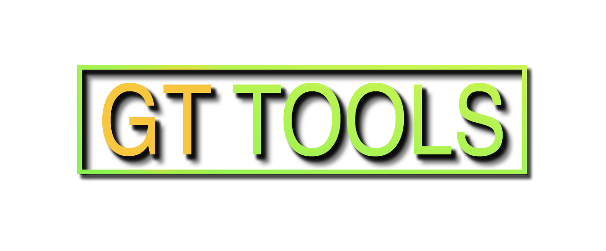

<!-- GT Tools README.md file -->

 

<a href="https://www.paypal.me/TrevisanGMW"> 

## Description
This is my collection of scripts for Autodesk Maya – These scripts were created with the aim of automating, enhancing or simply filling the missing details of what I find lacking in Maya.

After installing the script collection, you’ll find a pull-down menu that provides easy access to a variety of tools. This menu contains sub-menus that have been organized to contain related tools, for example: modeling, rigging, utilities, etc…

For help on how to use these scripts, click on the “Help” button at the top right of their window (within Maya) or check their documentation at the top of the script file (just open the “.py” or “.mel” file using any text editor, such as notepad)

All of these items are supplied as is. You alone are solely responsible for any issues. Use at your own risk. 
Hopefully these scripts are helpful to you as they are to me.

## Organization
* `mel-scripts`: contains scripts written in MEL
* `python-scripts`: contains scripts written in Python

## Installation

<b>TL;DR :</b> Download files, then open "setup.bat".

`Auto Installation`

This script collection comes with an auto installer (setup.bat) you can simply download it, run the setup and reopen Maya.
Here is how you do it in more details:
<ol>
	<li>Close Maya (in case it's opened).</li>
	<li>Download the latest release (or clone this repository).</li>
	<li>Un-zip (Decompress) the file you downloaded. (the setup won't work if it's still compressed)</li>
	<li>Open "setup.bat". (It will show you the options - "Install, Uninstall and About")</li>
	<li>Type "1" for the "install" option and press enter.</li>
	<li>Open Autodesk Maya.</li>
</ol>

If you want, you can now delete the downloaded/extracted files (as they have already been installed)

`Manual Installation`

In case you need/want to manually install the scripts. It's also a pretty straightforward process.
<ol>
	<li>Close Maya (in case it's opened).</li>
	<li>Download the latest release (or clone this repository).</li>
	<li>Un-zip (Decompress) the file you downloaded.</li>
	<li>Move all the contents from the folders "mel-scripts" and "python-scripts" to your scripts folder (usually located under the path below):
	<b>C:\Users\USERNAME\Documents\maya\VERSION\scripts\ </b></li>
	<li>In case you don't want to replace an already existing <b>"userSetup.mel" </b> script (inside your scripts folder), you can easily merge them by opening the existing one and adding the line: <code>source "gt_tools_menu.mel";" </code></li>
	(This command adds the menu when Maya opens)
	<li>Open Autodesk Maya. </li>
</ol>

## Uninstallation

`Auto Uninstallation`

<ol>
	<li>Close Maya (in case it's opened).</li>
	<li>Download the latest release (or clone this repository).</li>
	<li>Un-zip (Decompress) the file you downloaded.</li>
	<li>Open "setup.bat". (It will show you the options - "Install, Uninstall and About")</li>
	<li>Type "2" for the "uninstall" option and press enter.</li>
	<li>Open Autodesk Maya.</li>
</ol>

`Manual Uninstallation`

<ol>
	<li>Close Maya (in case it's opened).</li>
	<li>Navigate to your scripts folder, usually located under the following path:
	<b>C:\Users\USERNAME\Documents\maya\VERSION\scripts\ </b></li>
	<li>Delete all files starting with the prefix "gt_" (use the search bar to quickly select all of them)</li>
	<li>Open your <b>"userSetup.mel" </b> script (inside your scripts folder), and remove the line: <code>source "gt_tools_menu.mel";" </code></li>
	<li>Open Autodesk Maya. </li>
</ol>

## Frequently Asked Questions
<ul>
	<li><b>How do I update GT Tools to a new version?</b>  A: Simply install it again, it will overwrite previous files.</li>
	<li><b>What do I do if I have multiple "userSetup.mel" files? One inside "maya/####/scripts" and another one inside "maya/scripts"</b>  A: The "userSetup.mel" file gets executed when you open Maya, but Maya supports only one file. In case you have two files it will give priority to the file located inside "maya/####/scripts", so manage your initialization commands there.</li>
</ul>
## Licensing

The MIT License 2020 - Guilherme Trevisan