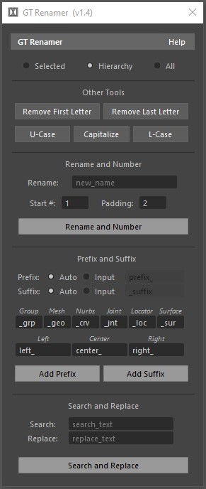

<!-- GT Tools Docs -->

<h1> GT Renamer </h1>

Script for renaming multiple objects.

<b>Modes: </b> - Selected: uses selected objects when renaming. - Hierarchy: uses hierarchy when renaming. - All: uses everything in the scene (even hidden nodes)

<b>Other Tools: </b> - Remove First Letter: removes the first letter of a name. If the next character is a number, it will be deleted. - Remove Last Letter: removes the last letter of a name. - U-Case: makes all letters uppercase. - Capitalize: makes the 1st letter of every word uppercase. - L-Case: makes all letters lowercase

<b>Rename and Number: </b>Renames selected objects and number them. - Start # : first number when countaing the new names. - Padding : how many zeros before the number. e.g. "001"

<b>Prefix and Suffix: </b> Prefix: adds a string in front of a name. Suffix: adds a string at the end of a name.  - Auto: Uses the provided strings to automatically name objects according to their type or position. 1st example: a mesh would automatically receive "_geo" 2nd example: an object in positive side of X, would automatically receive "left_: .  - Input: uses the provided text as a prefix or suffix.

<b>Search and Replace: </b>Uses the well-known method of search and replace to rename objects.

<h1> GT Path Manager </h1>

	 

This script displays a list with the name, type and path of any common nodes found in Maya. You can select the node listed by clicking on it or change its name or path by double clicking the cell.

The icon on the left describes the validity of the path. If the file or directory is found in the system it shows a green confirm icon otherwise it shows a red icon.

<b>Auto Path Repair: </b>This function walks through the folders under the provided directory looking for missing files. If it finds a match, the path is updated.

<b>Search and Replace: </b>This function allows you to search and replace strings in the listed paths.

<b>Refresh: </b>Re-populates the list while re-checking for path validity.

<b>Search Path: </b>A directory path used when looking for missing files.

